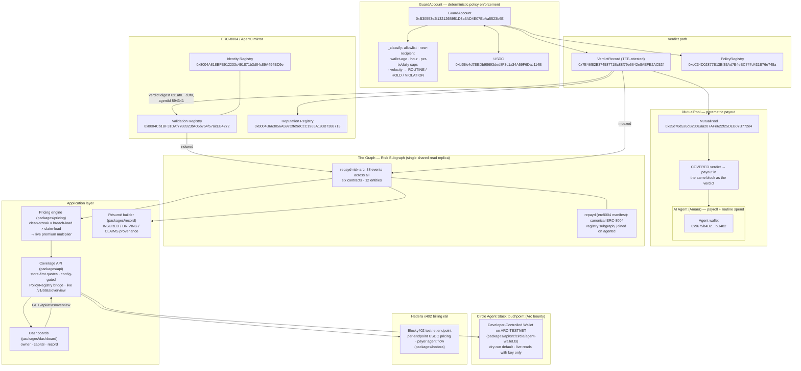

# REPAYD — Architecture

Full-stack architecture of the REPAYD agent insurance protocol on **Arc testnet (chain 5042002)**: a GuardAccount watches an AI agent's USDC payments, classifies every transaction deterministically, blocks violations pre-broadcast, holds anomalies for owner review, and pays covered claims parametrically — with every verdict mirrored to ERC-8004 registries, indexed by a Risk Subgraph, priced by a telematics-aware engine, and billed on a Hedera x402 rail.



## Data flow of the two-gasp demo

1. **Routine payment** — the agent's wallet sends USDC through the GuardAccount. `_classify` returns ROUTINE (allowlisted recipient, within caps) → executes. Pricing's clean streak grows.
2. **Violation payment** — $900 > $200 per-tx cap → `TIER_VIOLATION/OVER_PER_TX` → **blocked pre-broadcast** (no tx exists by design).
3. **Anomaly** — $150 to a 3-day-old fresh wallet at 4 AM → `NEW_RECIPIENT` → funds **held** (`nextHoldId` 3), owner freezes or releases within the 2-minute window.
4. **Covered claim** — breach confirmed → TEE-attested verdict posted to `VerdictRecord` (digest `0x1af03bc6…d3f0`, score 25 = COVERED) → MutualPool pays **135000000 units ($135.00)** to the policy owner **in the same block** → verdict mirrored to the ERC-8004 validation/reputation registries for agentId **894341** → subgraph indexes the events → pricing engine re-multiplies the next term.

## Consumers of the Risk Subgraph

Every AI consumer reads the **same** deployed subgraph endpoint instead of running its own indexer — The Graph is load-bearing, not decorative:

- **Pricing engine** — clean-day streaks increment on `ExecutedRoutine`, reset on violations; attempted-breach load +15%/30d; claim load ×3; streak discount −60% at 180 days.
- **Résumé builder** — renders the agent's INSURED/DRIVING/CLAIMS/ALIBI provenance.
- **Coverage API + dashboards** — live posture in the owner dashboard.

## Live proof — one-session curl transcript

Booted `packages/api/src/server.ts`, curled both read endpoints, then killed the server. Verbatim output (2026-09-12):

```
$ curl -s http://localhost:8787/v1/atlas/overview
{"chainId":5042002,"agent":{"erc8004AgentId":894341,"guard":"0xB30553e2f132126B951D3a6AD4E07EbAa5523b6E","owner":"0x9675b4D20d2ACFE55D00a02D55B9cdb57AEbD482"},"guard":{"usdc":"3200000000","dailyState":{"day":"20707","spent":"800000000","count":"4"},"nextHoldId":"3"},"pool":{"junior":"19865000000","senior":"25000000000"},"payout":{"amaraUsdc":"135000000"}}

$ curl -s http://localhost:8787/v1/circle/agent-wallet
{"mode":"dry-run","chain":"ARC-TESTNET","guardAccount":"0xB30553e2f132126B951D3a6AD4E07EbAa5523b6E","guardUsdcBalance":"3200000000","demoSpend":{"planned":false},"plannedCalls":[{"method":"POST","path":"/v1/w3s/developer/walletSets",…},{"method":"POST","path":"/v1/w3s/developer/wallets",…},{"method":"GET","path":"/v1/w3s/developer/wallets/balances?blockchain=ARC-TESTNET",…}]}
```

(Third planned-call body elided here for width; the full payload is shown in the appendix table's source, `packages/api/src/circle/agent-wallet.ts` `planCircleCalls()`.) The dashboard proxies these same endpoints at `/api/atlas/overview` and `/api/circle/agent-wallet`; when the API is down the owner page degrades to offline pills.

## Appendix — real deployed addresses (Arc testnet, chain 5042002)

| Component | Address |
|---|---|
| USDC | `0xb95fe4d7EEDb98693ded8F3c1a34A59F6Dac114B` |
| PolicyRegistry | `0xcC34D02877E13Bf35Ad7E4eBC747d431B76e748a` |
| VerdictRecord (TEE) | `0x7B46f82B37458771Bc88f79e5642e8AEFE2AC52f` |
| MutualPool | `0x35d78e526cB230Eaa287AFe622f25DEB07B772e4` |
| GuardAccount | `0xB30553e2f132126B951D3a6AD4E07EbAa5523b6E` |
| ERC-8004 Identity | `0x8004A818BFB912233c491871b3d84c89A494BD9e` (first code block 29241340; index window starts 61614321) |
| ERC-8004 Validation | `0x8004Cb1BF31DAf7788923b405b754f57acEB4272` (first code block 29241349; index window starts 61614321) |
| ERC-8004 Reputation | `0x8004B663056A597Dffe9eCcC1965A193B7388713` (first code block 29241344; index window starts 61614321) |
| Agent (ERC-8004 agentId) | **894341** |
| Policy owner (Amara) | `0x9675b4D20d2ACFE55D00a02D55B9cdb57AEbD482` |
| Verdict digest | `0x1af03bc6a70b6309bd5c9ec92c7d78c1024e0d69c9ea5ea60faf828c958ed3f0` |
| Covered payout | 135000000 units ($135.00 USDC) |

Stack startBlocks: usdc 61614321 · registry 61614324 · blocklist 61614329 · verdicts 61614331 · pool 61614333 · guard 61614335.
